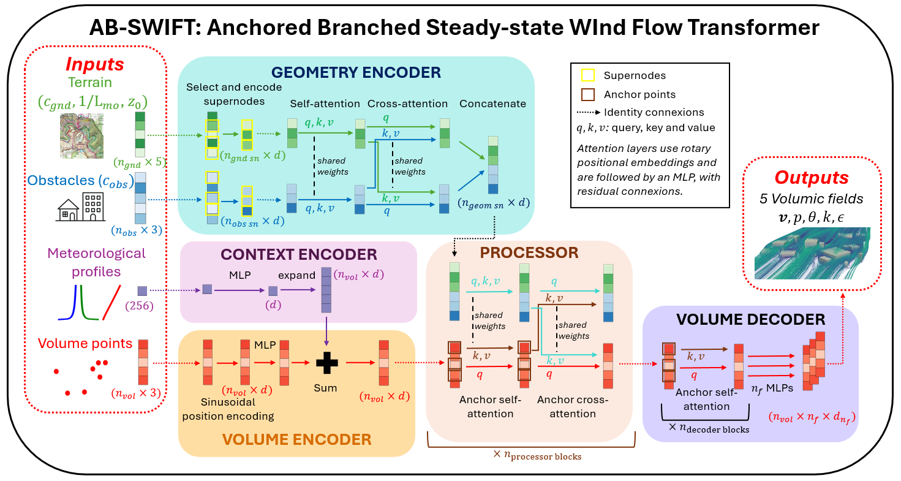

# AB-SWIFT: Anchored Branched Steady-state WInd Flow Transformer

.

AB-SWIFT is a model architecture specifically designed for modeling atmospheric flow around varied obstacles geometry and ground topology

## Utilisation

A sample training script can be found in `example/train.py`.

Additionally, `example/inference.py` can be used to test the trained model for a given test idx

The `dataset.data_dir` in `config.yaml` must be set to the path where the dataset in located

`example/config.yaml` contains configuration for both the training and inference

We provide trained model weights in `example/trained_model_ckpt/`

## Raw data

The raw dataset used in the paper can be found at https://zenodo.org/records/19249906

## Project Structure

```
abswift/
dataset
│   ├── random_buildings_dataset.py             # main dataset file
│   ├── mo_profiles.py                          # Monin-Obhukov similarity profiles computation
|   └── vtk_tools.py                            # Some vtk processing and plotting tools
model
│   ├── abswift.py                              # main model file
│   └── abswift_collator.py                     # Collator that preprocess the data
example                                         # Folder providing a sample training setup
│   ├── train.py                                # main training script
│   ├── inference.py                            # sample inference script
│   ├── config.yaml                             # sample configuration file
|   ├── trained_model_ckpt                      # folder containing the trained model weights
│   ├── modules                                 # link to AB-UPT's modules collection
│   ├── collators                               # link to AB-UPT's collators
│   └── preprocessors                           # link to AB-UPT's preprocessors
anchored-branched-universal-physics-transformer # git folder of AB-UPT
└── README.md                                   # This file
```

## Citation
If you use AB-SWIFT in your research, please cite our paper:
```
@Article{deVilleroche2026,
      title={Anchored-Branched Steady-state WInd Flow Transformer (AB-SWIFT): a metamodel for 3D atmospheric flow in urban environments}, 
      author={Armand de Villeroché and Rem-Sophia Mouradi and Vincent Le Guen and Sibo Cheng and Marc Bocquet and Alban Farchi and Patrick Armand and Patrick Massin},
      year={2026},
      eprint={2603.25635},
      archivePrefix={arXiv},
      url={https://arxiv.org/abs/2603.25635}, 
}
```
